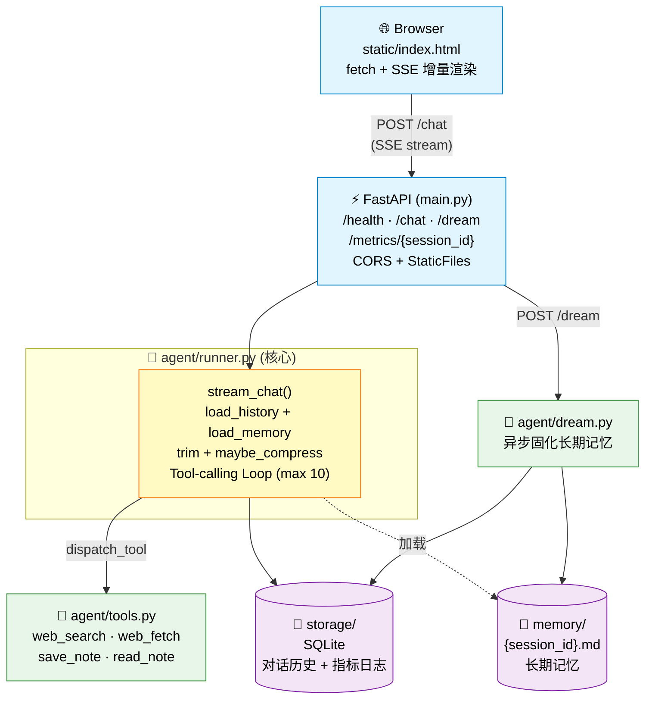

# 🤖 MiniBot

> 一个**从零手写**的 AI Agent —— 不依赖 LangChain / LangGraph,自研 Tool-calling Loop、上下文管理和长期记忆机制

[](https://www.python.org/)
[](https://fastapi.tiangolo.com/)
[](https://www.docker.com/)
[](LICENSE)
[](#)

## 🌐 项目已部署至腾讯云 CloudBase,可稳定访问。
> 演示链接暂不公开(避免 API 额度被刷),如需访问请联系作者。

---

## ✨ 为什么这个项目值得一看

传统 LLM 应用要么是"套壳 ChatGPT",要么是"用 LangChain 拼积木"。MiniBot 走的是第三条路 —— **完全手写核心组件,理解每一层的运作原理**。

### 🔧 核心亮点

- **🔁 自研 Tool-calling Loop** —— 手写 LLM ⇄ 工具 的多轮循环,支持并行工具调用与循环上限保护,单次会话最多 10 轮迭代
- **🧠 三层上下文管理** —— 短期记忆(消息截断)+ 中期记忆(LLM 摘要压缩)+ 长期记忆(Dream 机制固化到 Markdown),优雅应对 Context Window 限制
- **🌙 Dream 长期记忆固化** —— 借鉴人类睡眠中的记忆巩固机制,通过 `/dream` 端点异步将关键事实写入 `memory/{session_id}.md`,下次会话自动加载
- **📡 SSE 流式输出** —— 从后端 `yield` 到前端 `ReadableStream` 全链路流式,包括工具调用间隙的可见提示,用户看得到 Agent 在"思考"
- **📊 内置指标追踪** —— LLM 调用次数 / Token 消耗 / 工具调用次数 / Dream 触发次数,通过 `/metrics/{session_id}` 一键查看
- **🐳 一键容器化部署** —— Dockerfile + 腾讯云 CloudBase,从代码到公网访问全流程打通

### 🚫 项目取舍

- **不用 LangChain / LangGraph** —— 手写核心逻辑
- **不引入向量数据库** —— 长期记忆用 Markdown 文件,可读、可编辑、可 git 版本控制,适合小规模个人助手场景使用
- **不加用户认证** —— 定位为个人助手 + 演示项目,通过 `session_id` 隔离不同会话

## 🏗️ 架构一览



**数据流一句话**:用户消息 → FastAPI → runner 的 Tool-calling Loop → LLM 决定是否调工具 → 若调则执行 → 结果回喂给 LLM → 直至纯文本

## 📂 目录结构

```
minibot/
│
├── main.py                    ← FastAPI 入口(端点定义 + CORS + StaticFiles)
├── requirements.txt           ← Python 依赖清单
├── Dockerfile                 ← 容器化配置
├── docker-compose.yml         ← 本地 docker 编排
├── .env.example               ← API Key 模板(真实 .env 不上 git)
│
├── agent/                     ← Agent 核心逻辑
│   ├── runner.py              ← ⭐   stream_chat() + 上下文管理
│   ├── tools.py               ← 工具定义(web_search/web_fetch/save_note/read_note)
│   └── dream.py               ← 长期记忆固化(Dream 机制)
│
├── storage/                   ← 数据持久化层
│   ├── database.py            ← SQLite 建表 / 读写对话历史
│   ├── memory_store.py        ← 长期记忆文件读写(带路径穿越校验)
│   ├── metrics.py             ← 指标日志(LLM 调用/Token/工具调用)
│   └── minibot.db             ← SQLite 数据库文件(gitignore)
│
├── static/                    ← 前端
│   └── index.html             ← 单文件聊天页(HTML + CSS + JS)
│
├── memory/                    ← 每个 session 一份 Markdown(gitignore)
│   └── {session_id}.md
│
└── notes/                     ← save_note 工具的产物(gitignore)
```

---

## 💡 核心技术实现

### 1️⃣ 自研 Tool-calling Loop

大模型的"使用工具"本质是**多轮对话**：模型说"我要调 web_search 查 X",系统执行后把结果回喂,模型基于结果再回复或继续调工具。LangChain 把这个循环包成 AgentExecutor,MiniBot 选择**手写**——理解清楚原理再谈框架。

**核心循环骨架**(位于 `agent/runner.py` 的 `stream_chat()`):

```python
for _ in range(MAX_ITERATIONS):  # 循环上限保护,防止工具滥用
    stream = client.chat.completions.create(
        model=model,
        messages=trim_message(messages, max_turns=10),
        tools=TOOLS_SCHEMA,
        stream=True,
    )
    
    # 流式收集 content 和 tool_calls
    for chunk in stream:
        if delta.content:
            yield delta.content              # 边生成边推给前端
        if delta.tool_calls:
            accumulate_tool_calls(...)       # 按 index 累积 id/name/arguments

    if finish_reason == "stop":              # 分支 A: 纯文本 → 返回
        save_message(assistant_msg); return
    
    if finish_reason == "tool_calls":        # 分支 B: 调工具 → 执行 → 继续循环
        save_message(assistant_with_tool_calls)
        for tc in tool_calls:
            result = dispatch_tool(tc.name, json.loads(tc.arguments))
            save_message({"role": "tool", "tool_call_id": tc.id, "content": result})
        continue
```

**几个关键设计决策**:

- **`MAX_ITERATIONS = 10`**:防止模型陷入"调工具 → 结果不满意 → 再调"的死循环导致 token 爆炸
- **流式 tool_calls 增量拼接**:OpenAI 兼容 API 会把 `arguments` 一段段推,需要用字典按 `index` 累积后再 `json.loads`,不能收到一段解一段
- **`assistant` 消息 `content` 可以是 `None`**:仅调工具时无文本回复,OpenAI 规范允许 null;但**必须带 `tool_calls` 字段**,否则下一轮 API 会拒绝
- **`tool_call_id` 严格配对**:每条 `role="tool"` 的消息必须回引对应的 `tool_call_id`,DeepSeek/OpenAI 会做严格校验,配错就 400

**支持的工具**(可插拔,注册到 `TOOLS_SCHEMA` 即生效):

| 工具 | 作用 | 依赖 |
|---|---|---|
| `web_search` | 网络搜索 | Tavily API |
| `web_fetch` | 抓取网页正文 | httpx + trafilatura |
| `save_note` | 写笔记到本地 | 无 |
| `read_note` | 读取笔记 | 无 |

---

### 2️⃣ 三层上下文管理

LLM 有 Context Window 限制(比如 DeepSeek 是 64k / 128k tokens),对话越长,越贵、越慢、越容易被截断。MiniBot 用**三层策略**优雅地控制上下文规模:

| 层级 | 触发条件 | 做什么 | 位置 |
|---|---|---|---|
| **短期(截断)** | 每次请求 | 只发送最近 10 轮 user 消息 | `trim_message()` |
| **中期(摘要压缩)** | 消息总数 > 20 条 | 把老对话用 LLM 压成一段摘要,保留最近 4 轮原文 | `maybe_compress()` |
| **长期(Dream 固化)** | 手动触发 `/dream` | 提取关键事实写入 `memory/{session_id}.md`,下次会话自动加载 | `agent/dream.py` |

**短期截断骨架**:

```python
def trim_message(messages, max_turns=10):
    # 保留 system prompt,从末尾反向数 10 条 user 消息,之前的全部丢弃
    for i in range(len(rest)-1, -1, -1):
        if rest[i]["role"] == "user":
            user_count += 1
            if user_count == max_turns:
                cut = i
                break
    return [system_msg] + rest[cut:]
```

**中期摘要压缩骨架**:

```python
def maybe_compress(messages, threshold=20, keep_recent_turns=4):
    if len(messages) <= threshold:
        return messages
    
    # 切成两段:老的 to_summarize 送 LLM 压缩,新的 to_keep 保留原文
    summary_text = summarize_message(to_summarize)
    summary_msg = {
        "role": "system",
        "content": f"以下是之前对话的摘要(用于唤起记忆):\n{summary_text}"
    }
    return [system_msg, summary_msg] + to_keep
```

**关键设计决策**:

- **短期用"截断"而非"摘要"**:每次都摘要成本太高,截断是 O(1) 操作,只在真超长时(threshold=20)才触发摘要
- **`keep_recent_turns=4` 保留原文**:摘要会丢失细节,最近几轮必须完整保留才能让模型"记得刚说过什么"
- **摘要 prompt 明确要求**:"保留用户的关键信息、已作出的决定、未完成的任务",避免 LLM 摘要成流水账
- **摘要以 `role="system"` 注入**:让模型把它当作"背景知识"而不是"上一轮对话",行为更稳定

**为什么不用向量库 / RAG？**

这是面试常见追问。MiniBot 的场景是**个人助手 + 短会话(通常 < 30 轮)**,三层策略已足够:
- 短期截断:处理 90% 的普通对话
- 中期摘要:处理长会话(> 20 条)
- 长期 Dream:跨会话的关键事实持久化

**引入向量库的代价**:embedding 生成延迟、向量库依赖、检索准确率调优——ROI 不划算。如果扩展到"读几百本书做 Q&A"这类场景,再引 RAG 也不迟。

---

### 3️⃣ Dream 长期记忆固化

**灵感来源**：人在睡眠时,大脑会把白天的零散经历整理成长期记忆。MiniBot 的 Dream 机制模拟这个过程 —— 手动触发一次"睡眠",让 LLM 把这次会话的关键信息**沉淀成用户档案**,写入 Markdown 文件,下次会话自动加载。

**触发方式**:

```bash
curl -X POST http://localhost:8000/dream \
  -H "Content-Type: application/json" \
  -d '{"session_id": "your_session_id"}'
```

**核心流程**(`agent/dream.py`):

```python
def dream(session_id):
    # 1. 拉齐两份原料
    existing_memory = load_memory(session_id)      # 之前的档案(可能为空)
    messages = load_history(session_id)             # 本次会话所有消息
    
    # 2. 让 LLM 做"记忆整理助手"
    response = client.chat.completions.create(
        model=model,
        messages=[
            {"role": "system", "content": DREAM_SYSTEM_PROMPT},
            {"role": "user", "content": f"[已有记忆]{existing_memory}\n[本次会话]{conversation}"}
        ],
        temperature=0.3    # 低随机性,记忆整理要稳定
    )
    
    # 3. 覆盖写入 memory/{session_id}.md
    new_memory = response.choices[0].message.content.strip()
    save_memory(session_id, new_memory)
    return new_memory
```

**System Prompt 的关键约束**(节选):

- **只保留跨会话稳定信息**:用户身份、偏好、长期目标、正在做的事
- **忽略一次性琐碎对话**:"1+1 等于几"、"今天天气"这类不进档案
- **Markdown 分小节**:`## 基本信息` / `## 偏好` / `## 长期任务`
- **冲突以新信息为准**:用户改了口就以最新的为准,不做保留
- **不许编造**:用户没说的不许推测

**下次会话自动加载**(`runner.py`):

```python
memory_text = load_memory(session_id)
if memory_text and messages[0]["role"] == "system":
    # 拼接到 system prompt 后面,以 --- 分隔
    messages[0]["content"] = (
        f"{base_prompt}\n\n---\n"
        f"以下是你对该用户的长期记忆(用户档案),回答时可以参考:\n"
        f"{memory_text}"
    )
```

**关键设计决策**:

- **不用向量库,用纯 Markdown**:文件肉眼可读、可以 `git diff` 追踪档案演化、用户可以手动修改 —— 对个人助手场景是**最合适的存储介质**
- **`temperature=0.3`**:记忆整理是**结构化任务**,不需要创造性,低温度保证多次执行结果一致
- **手动触发而非自动**:自动触发意味着每次对话结束都要跑一次 LLM,浪费 token;手动触发让用户/系统在合适时机(比如会话结束、达到 N 轮)才整理
- **路径穿越校验**:`save_memory` 会校验 `session_id` 不能包含 `../`,避免恶意 session_id 写到系统文件

---

### 4️⃣ SSE 流式输出(全链路)

普通请求是"等 LLM 全部生成完再一次性返回",延迟感明显(几秒到几十秒)。MiniBot 用 **Server-Sent Events (SSE) + Python 生成器 + 前端 ReadableStream**,做到**从 LLM 到浏览器的全链路增量流式** —— 用户第一个字延迟 < 500ms,像 ChatGPT 一样打字机效果。

**后端:生成器 + StreamingResponse**(`main.py` + `runner.py`):

```python
# runner.py: stream_chat 是一个 Python 生成器,用 yield 逐段吐出
def stream_chat(user_message, session_id):
    for _ in range(MAX_ITERATIONS):
        stream = client.chat.completions.create(..., stream=True)
        for chunk in stream:
            if delta.content:
                yield delta.content              # 文本片段
        if finish_reason == "tool_calls":
            yield f"\n[调用工具{name}]\n"        # 工具调用提示也一起流

# main.py: 把生成器包装成 SSE 响应
@app.post("/chat")
async def chat_endpoint(request: ChatRequest):
    def event_generator():
        for piece in stream_chat(request.message, request.session_id):
            data = json.dumps({"text": piece}, ensure_ascii=False)
            yield f"data:{data}\n\n"    # SSE 协议格式
        yield "data:[DONE]\n\n"
    return StreamingResponse(event_generator(), media_type="text/event-stream")
```

**SSE 协议格式**(简单直接,不需要 WebSocket 那么重):

```
data:{"text":"你好"}

data:{"text":","}

data:{"text":"我是"}

data:[DONE]

```

- 每条消息以 `data:` 开头
- 消息之间用 `\n\n` 分隔
- 结束标志用自定义的 `[DONE]`
- `ensure_ascii=False` 确保中文不被转义成 `\uXXXX`

**前端:ReadableStream + buffer 拼接**(`static/index.html`):

```javascript
const reader = response.body.getReader();
const decoder = new TextDecoder();
let buffer = '';  // 关键:缓冲跨 chunk 的消息片段

while (true) {
    const {done, value} = await reader.read();
    if (done) break;
    buffer += decoder.decode(value, {stream: true});
    
    const parts = buffer.split('\n\n');
    buffer = parts.pop();      // 最后一段可能不完整,留在 buffer 里等下一批
    
    for (const part of parts) {
        if (!part.startsWith('data:')) continue;
        const dataStr = part.slice(5);
        if (dataStr === '[DONE]') continue;
        const obj = JSON.parse(dataStr);
        output.textContent += obj.text;    // 追加到界面,打字机效果
    }
}
```

**关键设计决策**:

- **用 SSE 不用 WebSocket**:MiniBot 只需要**单向**(服务器 → 客户端)推送,SSE 是 HTTP 之上的轻量方案,不需要握手升级、自带断线重连、和普通 REST 共存无冲突
- **`buffer.split('\n\n')` + `parts.pop()`**:网络 chunk 边界不等于 SSE 消息边界,一条消息可能被切在两个 TCP chunk 里 —— **必须**用 buffer 缓冲最后一段等下一批
- **工具调用间隙也 `yield` 提示**:`\n[调用工具web_search]\n` 让用户看到 Agent 在"做事"而不是"卡住",体感差异巨大
- **`ensure_ascii=False`**:中文场景必须加,否则前端 JSON.parse 出来是 `\u4f60\u597d`,虽然能解析但传输膨胀 6 倍

**踩过的坑**:

- **`--reload` 触发的连接中断**:uvicorn 默认监听工作目录,`static/` 或 `memory/` 文件一变就重启,流式请求中途会 502。解决方案:启动时指定 `--reload-dir agent --reload-dir storage` 限定监视范围。
- **DeepSeek 思考模型的 reasoning_content**:某些模型在 delta 里会有 `reasoning_content` 但 `content=None`,需要 `if delta.content:` 判断跳过思考阶段。

---

## 📊 性能指标

MiniBot 内置**指标追踪系统**(`storage/metrics.py`),所有 LLM 调用、工具调用、Dream 触发都会被埋点到 SQLite `metrics` 表,通过 `GET /metrics/{session_id}` 查询。

### 实测数据(参考)

以下为在 **DeepSeek `deepseek-v4-flash`** 模型下的典型会话测试:

| 场景 | LLM 调用 | Token 消耗 | 工具调用 | 首字节延迟 |
|---|---|---|---|---|
| 单轮闲聊("你好,我叫小明") | 1 次 | ~700 tokens | 0 | < 500ms |
| 单次工具调用("帮我搜一下 Python 是什么") | 3 次 | ~4600 tokens | web_search × 1 | < 1s |
| 多轮混合("搜索 → 保存笔记 → 追问") | 5-7 次 | ~8000-12000 tokens | 2-3 次 | < 1s |
| Dream 记忆整理 | 1 次 | ~1500 tokens | 0 | ~3s |

**指标接口示例**:

```bash
curl http://localhost:8000/metrics/your_session_id
```

返回:

```json
{
    "session_id": "session_1728975300123_a4f9",
    "llm_calls": 3,
    "prompt_tokens": 4701,
    "completion_tokens": 630,
    "total_tokens": 5331,
    "tool_calls_total": 1,
    "tool_calls_by_name": {"web_search": 1},
    "dream_count": 0
}
```

### 关键观察

- **工具调用 = 3 次 LLM**:一次工具调用产生**至少 3 次** LLM 请求(判断要调工具 → 调工具 → 拿结果再生成回复)。这是 Agent 成本高的根源
- **prompt_tokens 占大头**:每次调用都要把完整对话历史 + system prompt 送进去,`prompt` 通常是 `completion` 的 **5-10 倍**——这也是为什么**上下文管理如此重要**
- **首字节延迟 < 500ms**:得益于 SSE 流式输出,即便完整回复要 5 秒,用户 500ms 内就看到第一个字
- **Dream 单次消耗可控**:一次记忆整理只需要 ~1500 tokens,即使每天触发一次,月度 API 成本可忽略

### 前端指标看板

前端提供**一键指标查看按钮**,点击后弹出当前会话的完整指标面板:

- LLM 调用次数
- Token 消耗(prompt / completion / total)
- 工具调用次数(按工具名分组)
- Dream 触发次数

---

## 🚀 快速开始

### 前置要求

- Python 3.11+ (推荐 3.12)
- Git
- 可用的 API Key:
  - **DeepSeek API** (主 LLM,便宜稳定,推荐)
  - **Tavily API** (web_search 工具依赖,免费额度足够测试)

### 本地运行

**1. 克隆仓库**

```bash
git clone <你的仓库地址>
cd minibot
```

**2. 安装依赖**

```bash
# 创建虚拟环境(推荐)
python -m venv .venv
source .venv/bin/activate       # Windows: .venv\Scripts\activate

# 安装依赖
pip install -r requirements.txt
```

**3. 配置环境变量**

复制 `.env.example` 为 `.env`,填入你的 API Key:

```bash
cp .env.example .env
```

编辑 `.env`:

```bash
OPENAI_API_KEY=sk-xxxxx                        # DeepSeek API Key
OPENAI_BASE_URL=https://api.deepseek.com      # DeepSeek 端点
OPENAI_MODEL=deepseek-v4-flash                 # 模型名
TAVILY_API_KEY=tvly-xxxxx                       # Tavily API Key
```

**API Key 获取**:

- DeepSeek: [https://platform.deepseek.com/api_keys](https://platform.deepseek.com/api_keys)
- Tavily: [https://tavily.com](https://tavily.com) (注册即送免费额度)

**4. 启动服务**

```bash
uvicorn main:app --reload
```

看到:

```
INFO:     Application startup complete.
INFO:     Uvicorn running on http://127.0.0.1:8000
```

**5. 打开浏览器访问**

```
http://127.0.0.1:8000
```

开始对话！试试:

- `"你好,我叫小明"`
- `"帮我搜一下 Python 是什么"`
- `"保存一条笔记,标题是'测试',内容是'hello'"`

---

### Docker 部署

**构建镜像**:

```bash
docker build -t minibot:latest .
```

**运行容器**:

```bash
docker run -d \
  -p 8000:8000 \
  -v $(pwd)/storage:/app/storage \
  -v $(pwd)/memory:/app/memory \
  -v $(pwd)/notes:/app/notes \
  --env-file .env \
  --name minibot \
  minibot:latest
```

**访问**: `http://localhost:8000`

---

### 触发 Dream 记忆整理

```bash
curl -X POST http://localhost:8000/dream \
  -H "Content-Type: application/json" \
  -d '{"session_id": "你的session_id"}'
```

session_id 在前端页面右上角可以看到。

---

## 📡 API 端点

MiniBot 提供 **4 个 REST API 端点**,均基于 FastAPI,支持自动生成 OpenAPI 文档(访问 `http://localhost:8000/docs` 查看交互式文档)。

### 端点总览

| 方法 | 路径 | 说明 | 响应类型 |
|---|---|---|---|
| `GET` | `/health` | 健康检查 | JSON |
| `POST` | `/chat` | 对话(流式) | SSE Stream |
| `POST` | `/dream` | 触发长期记忆整理 | JSON |
| `GET` | `/metrics/{session_id}` | 查询会话指标 | JSON |

---

### `GET /health`

**用途**:健康检查,给 Docker/K8s 探针用。

**请求**:

```bash
curl http://localhost:8000/health
```

**响应**:

```json
{"status": "ok", "message": "MiNiBot is running!"}
```

---

### `POST /chat`

**用途**:发送用户消息,以 **SSE 流式**返回 AI 回复。

**请求体**:

```json
{
    "message": "帮我搜一下 Python 是什么",
    "session_id": "session_1728975300123_a4f9"
}
```

**响应格式**(`text/event-stream`):

```
data:{"text":"Python"}

data:{"text":"是一种"}

data:{"text":"高级"}

...

data:[DONE]

```

**cURL 示例**:

```bash
curl -N -X POST http://localhost:8000/chat \
  -H "Content-Type: application/json" \
  -d '{"message":"你好","session_id":"test_001"}'
```

> `-N` 参数关闭 curl 缓冲,让流式输出实时显示。

---

### `POST /dream`

**用途**:触发长期记忆整理,把会话历史压缩成用户档案写入 `memory/{session_id}.md`。

**请求体**:

```json
{"session_id": "session_1728975300123_a4f9"}
```

**响应**:

```json
{
    "memory": "## 基本信息\n- 用户名:小明\n\n## 偏好\n- 学习方式:一步一步带..."
}
```

**cURL 示例**:

```bash
curl -X POST http://localhost:8000/dream \
  -H "Content-Type: application/json" \
  -d '{"session_id":"test_001"}'
```

---

### `GET /metrics/{session_id}`

**用途**:查询指定会话的完整埋点数据。

**cURL 示例**:

```bash
curl http://localhost:8000/metrics/session_1728975300123_a4f9
```

**响应**:

```json
{
    "session_id": "session_1728975300123_a4f9",
    "llm_calls": 3,
    "prompt_tokens": 4701,
    "completion_tokens": 630,
    "total_tokens": 5331,
    "tool_calls_total": 1,
    "tool_calls_by_name": {"web_search": 1},
    "dream_count": 0
}
```

### 交互式文档

访问 `http://localhost:8000/docs` 查看 **Swagger UI**,可直接在浏览器里调用所有端点。

---

## 🛠️ 技术栈

**后端**:
- **Python 3.12** + **FastAPI 0.115** — 异步 Web 框架,原生支持 SSE 流式响应
- **OpenAI SDK** — 兼容 DeepSeek/OpenAI/其他 OpenAI-compatible 端点
- **SQLite** — 消息历史 + 指标埋点,零配置,单文件

**LLM & 工具**:
- **DeepSeek `deepseek-v4-flash`** — 主对话模型(便宜、快、Function Calling 稳)
- **Tavily API** — 网络搜索工具
- **trafilatura** — 网页正文抽取(比 BeautifulSoup 更聚焦)

**前端**:
- 原生 **HTML + JS**,无框架依赖
- `fetch` + `ReadableStream` 处理 SSE
- `localStorage` 持久化 session_id

**部署**:
- **Docker** 容器化(多阶段构建,镜像 < 200MB)
- **腾讯云 CloudBase** 云端部署

---

## 🐛 已知限制

- **单用户设计**:无鉴权,默认单机自用;开放公网需自行加 API Key middleware + 限流
- **单会话前端**:前端一次只显示一个会话,切换需点"新对话"(未做侧边栏多会话列表)
- **网络中断可能污染 DB**:tool-calling 循环中途断流,可能存下"孤儿 assistant"消息导致下一轮 400。当前解法:切官方 API + 前端"新对话"按钮重开 session
- **Dream 手动触发**:未做自动触发策略(N 轮后自动/会话结束自动)
- **无向量检索**:memory 是纯 Markdown 全量拼接进 system prompt,档案变大后会挤占上下文

---

## 🗺️ Roadmap

- [ ] tool-calling 循环加**事务性写入**,避免网络中断导致孤儿消息
- [ ] Dream **自动触发**策略(每 N 轮 / 会话闲置 M 分钟)
- [ ] memory 分层:核心档案(全量) + 事件流(向量检索)
- [ ] 加**用户鉴权**(API Key + 限流),支持公开演示
- [ ] Prompt caching 优化,降低 Token 成本

---

## 📜 License

[MIT License](LICENSE) © 2026 [nonameanno]

---

## 🙏 致谢

- **DeepSeek** — 提供便宜稳定的国产 LLM API
- **Tavily** — 为 AI Agent 场景优化的搜索 API
- **FastAPI** — 最舒服的 Python Web 框架

---

<p align="center">
  <sub>Built with ☕ and a lot of debugging.</sub>
</p>


